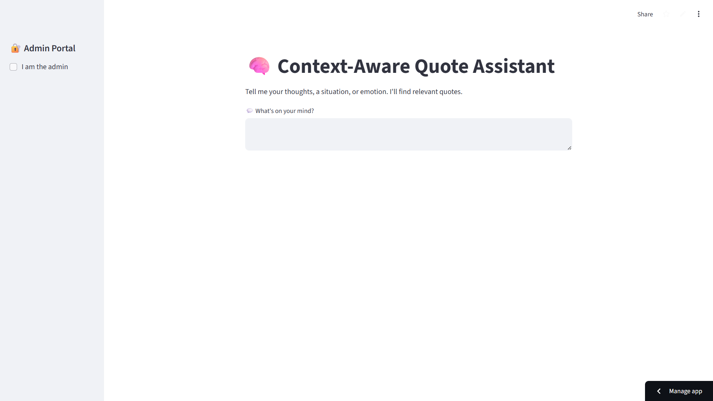
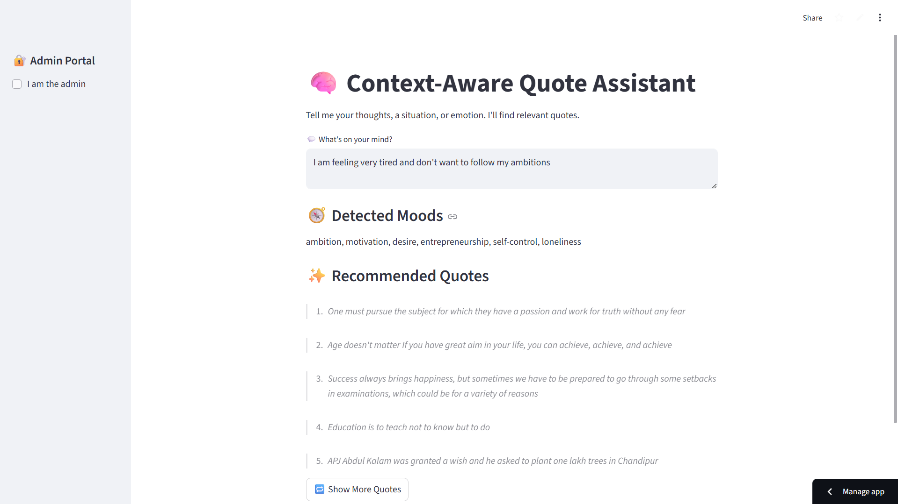

# 🧠 Context-Aware Quote Assistant



An intelligent quote recommendation system powered by Natural Language Processing (NLP) that uses semantic similarity to match user input with relevant quotes. Built with Streamlit and Sentence Transformers, this application provides personalized quote recommendations based on your thoughts, emotions, or situations.

## ✨ Features

- **Semantic Quote Matching**: Uses advanced NLP models to understand context and find relevant quotes
- **Automatic Mood Detection**: Detects emotions, themes, and moods from user input using a comprehensive tag pool
- **Intelligent Ranking**: Combines semantic similarity (70%) and tag overlap (30%) for accurate quote recommendations
- **Admin Portal**: Secure admin interface to add new quotes with automatic tagging
- **Auto-Tagging System**: Automatically assigns relevant tags to quotes using machine learning
- **User-Friendly Interface**: Clean, intuitive Streamlit-based web interface

## 📸 Screenshots

### Main Interface


### Application Demo


## 🚀 Getting Started

### Prerequisites

- Python 3.7 or higher
- pip (Python package manager)

### Installation

1. **Clone the repository** (or navigate to the project directory):
   ```bash
   cd quote-nlp-app
   ```

2. **Install dependencies**:
   ```bash
   pip install -r requirements.txt
   ```

3. **Set up environment variables** (optional, for admin access):
   Create a `.env` file in the project root:
   ```
   ADMIN_EMAIL=your_email@example.com
   ADMIN_PASSWORD=your_secure_password
   ```
   If you don't create a `.env` file, admin features will still work but you'll need to set these values directly in `app.py`.

4. **Prepare your quotes data**:
   - Option 1: Use the existing `quotes.json` file
   - Option 2: Convert your own quotes from text to JSON:
     ```bash
     python convert_txt_to_json.py
     ```
   - Option 3: Auto-tag quotes from a text file:
     ```bash
     python auto_tag_quotes.py
     ```

### Running the Application

Start the Streamlit app:
```bash
streamlit run app.py
```

The application will open in your default web browser at `http://localhost:8501`.

## 📖 Usage

### For Regular Users

1. **Enter your thoughts**: Type your current situation, emotion, or thought in the text area
2. **View detected moods**: The system automatically detects relevant moods/tags from your input
3. **Get recommendations**: See top-ranked quotes that match your context
4. **Load more quotes**: Click "Show More Quotes" to see additional recommendations

### For Administrators

1. **Access admin portal**: Check "I am the admin" in the sidebar
2. **Login**: Enter your admin email and password (from `.env` file)
3. **Add quotes**: Use the "Add New Quote" section to add quotes
4. **Auto-tagging**: New quotes are automatically tagged with relevant themes

## 📁 Project Structure

```
quote-nlp-app/
├── app.py                    # Main Streamlit application
├── auto_tag_quotes.py        # Script to auto-tag quotes from text file
├── convert_txt_to_json.py    # Script to convert text quotes to JSON
├── my_quotes.txt            # Raw quotes (one per line)
├── quotes.json              # Tagged quotes in JSON format
├── Quote-nlp-app-1.png     # Application screenshot 1
├── Quote-nlp-app-2.png     # Application screenshot 2
├── requirements.txt         # Python dependencies
├── README.md               # This file
└── .env                    # Environment variables (create this file)
```

## 🔧 Scripts

### `convert_txt_to_json.py`
Converts quotes from a plain text file (`my_quotes.txt`) to JSON format, removing duplicates.

**Usage:**
```bash
python convert_txt_to_json.py
```

### `auto_tag_quotes.py`
Reads quotes from `my_quotes.txt`, automatically tags them using NLP, and saves to `quotes.json`.

**Usage:**
```bash
python auto_tag_quotes.py
```

**What it does:**
- Loads the Sentence Transformer model (`all-MiniLM-L6-v2`)
- Encodes each quote and compares with a tag pool
- Assigns top 6 most relevant tags to each quote
- Saves structured data to `quotes.json`

## 🏷️ Tag Categories

The system uses a comprehensive tag pool covering:

- **Emotions**: happiness, sadness, peace, stress, loneliness, confidence, hope, anger, grief, anxiety, fear, joy, contentment
- **Personal Growth**: motivation, discipline, consistency, self-control, focus, purpose, ambition, resilience, growth, habits, mindset
- **Life Philosophy**: life, death, truth, meaning, freedom, destiny, acceptance, regret, change, choices, wisdom, time, reflection
- **Relationships**: love, compassion, empathy, friendship, family, connection, kindness, forgiveness, trust, heartbreak
- **Business & Success**: money, business, success, leadership, risk, entrepreneurship, opportunity, value, productivity
- **Spirituality**: spirituality, karma, consciousness, mindfulness, humility, gratitude, faith, ethics, balance
- **Nature**: nature, simplicity, beauty, calm, environment, animals, trees, seasons, universe, earth, space
- **Challenges**: lust, desire, greed, addiction, ego, materialism, envy, jealousy, temptation

## 🛠️ Technologies Used

- **Streamlit**: Web application framework
- **Sentence Transformers**: NLP model for semantic similarity (`all-MiniLM-L6-v2`)
- **PyTorch**: Deep learning framework (dependency of sentence-transformers)
- **python-dotenv**: Environment variable management

## 🧠 How It Works

1. **User Input Processing**: When a user enters text, the system:
   - Encodes the input using the Sentence Transformer model
   - Compares it with the tag pool to detect relevant moods/tags
   - Selects top 6 most relevant tags

2. **Quote Ranking**: The system:
   - Filters quotes that match at least one detected tag
   - Computes semantic similarity between user input and each quote
   - Calculates tag overlap score
   - Combines scores (70% semantic + 30% tag overlap) for final ranking

3. **Auto-Tagging**: When adding new quotes:
   - The quote is encoded and compared with the tag pool
   - Top 6 most semantically similar tags are automatically assigned

## 📝 Data Format

Quotes are stored in JSON format:
```json
[
    {
        "quote": "Your quote text here",
        "tags": ["tag1", "tag2", "tag3", "tag4", "tag5", "tag6"]
    }
]
```

## 🔒 Security Notes

- Admin credentials are stored in environment variables (`.env` file)
- Never commit `.env` file to version control
- Use strong passwords for admin access

## 🎯 Example Use Cases

- **Feeling stressed?** Type "I'm overwhelmed with work" → Get quotes about stress, balance, and resilience
- **Need motivation?** Type "I want to achieve my goals" → Get quotes about ambition, discipline, and success
- **Reflecting on life?** Type "What is the meaning of life?" → Get quotes about meaning, wisdom, and purpose

## 🤝 Contributing

Feel free to:
- Add more quotes to `my_quotes.txt` and run `auto_tag_quotes.py`
- Expand the tag pool in `app.py` and `auto_tag_quotes.py`
- Improve the ranking algorithm
- Enhance the UI/UX

## 📄 License

This project is open source and available for personal and educational use.
The project belongs to https://github.com/digambars-git-hub/

## 🙏 Acknowledgments

- Sentence Transformers library by UKPLab
- Streamlit for the web framework
- The `all-MiniLM-L6-v2` model for semantic understanding

---

**Enjoy finding the perfect quote for every moment! 💫**

